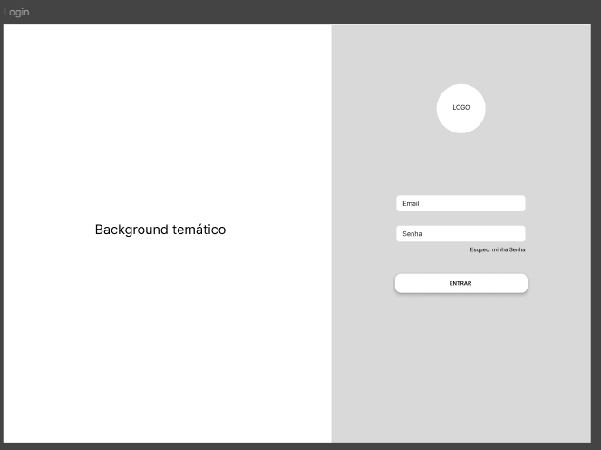
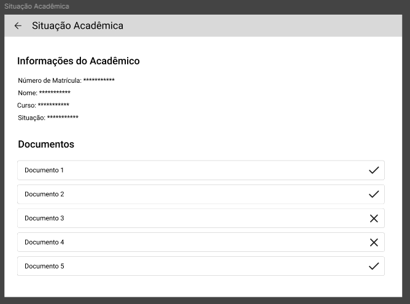
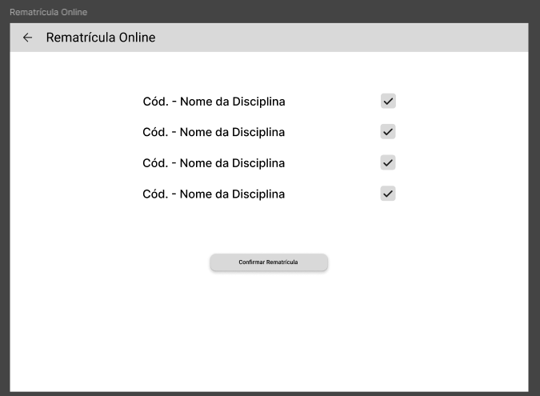
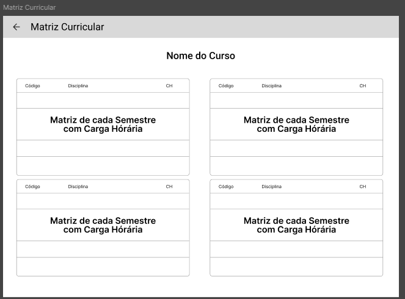
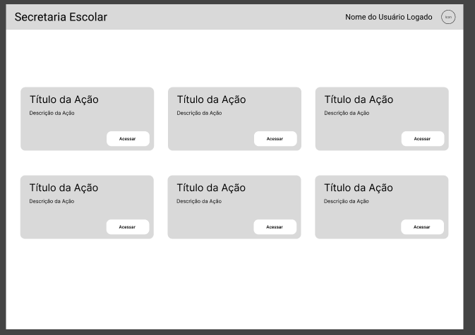

# Universidade Estadual do Tocantins
**Disciplina:** Desenvolvimento Mobile  
**Professor:** Jocivan  
**Alunos:** Filipe Dias Barreto, Lucas Castro

## 📌 Trabalho A2 – Aplicativo Mobile Acadêmico

---

## 🔗 Link do Repositório
> _https://github.com/filipebdias/A2_Mobile
> 
> Usuário do sistema 
> email: carlos@unitins.br
> senha: pass1234
> email: joao@unitins.br
> senha: 123456

---

## 🧪 Prototipação

As telas abaixo representam a interface desenvolvida para o aplicativo mobile acadêmico:

*Figura 1 – Tela de Login*
  

*Figura 2 – Situação Acadêmica*
  

*Figura 3 – Rematrícula Online*
  

*Figura 4 – Matriz Curricular*
  

*Figura 5 – Boletim Acadêmico*
  

*Figura 6 – Dashboard*

  

---

## ⚙️ Funcionalidades Principais

- **Tela de Login:**  
  Permite ao usuário acessar o sistema com nome de usuário e senha. 

- **Dashboard:**  
  Exibe um resumo geral com atalhos para as principais funcionalidades como boletim, grade curricular, situação acadêmica, entre outras.

- **Boletim Acadêmico:**  
  Apresenta as disciplinas cursadas, com notas da A1, A2 e Exame Final, além de calcular e exibir automaticamente a média final e o status (Aprovado, Em Andamento, Reprovado).

- **Grade Curricular:**  
  Exibe a grade de disciplinas por período, de forma interativa, permitindo ao aluno navegar pelos semestres.

- **Análise Curricular:**  
  Mostra o progresso do aluno nas disciplinas, incluindo status com cores para melhor visualização:
    - 🟢 Aprovado
    - 🟡 Em andamento

- **Rematrícula Online:**  
  Permite ao aluno selecionar e se rematricular nas disciplinas do próximo semestre, respeitando pré-requisitos e situação acadêmica.

- **Situação Acadêmica:**  
  Mostra o status de matrícula e documentos pendentes. O sistema também permite envio de documentos diretamente pelo app.

---

## ✅ Requisitos do Sistema

### 🔐 Tela de Login
- Entrada de nome de usuário e senha
- Validação de credenciais
- Redirecionamento para o Dashboard

### 🧭 Dashboard
- Exibição de panorama geral do aluno
- Acesso rápido às demais funcionalidades

### 📊 Boletim Acadêmico
- Visualização de disciplinas, notas e faltas
- Cálculo automático da média final
- Indicação de status da disciplina

### 🗂 Grade Curricular
- Navegação por períodos letivos
- Visualização de disciplinas planejadas por semestre

### 📈 Análise Curricular
- Exibição de status das disciplinas
- Código de cores para facilitar interpretação (verde e amarelo)

### 📌 Rematrícula
- Listagem de disciplinas disponíveis para matrícula
- Verificação de pendências acadêmicas antes da confirmação

### 📄 Situação Acadêmica
- Exibição da lista de documentos obrigatórios
- Indicação do status de envio de cada documento
- Upload de documentos diretamente no app
